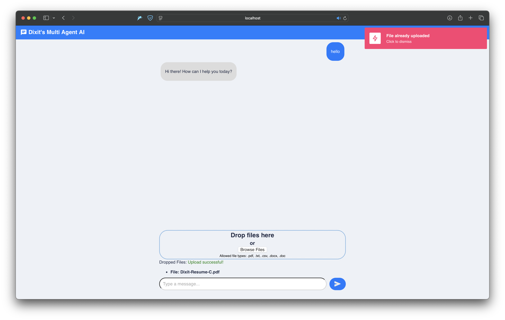
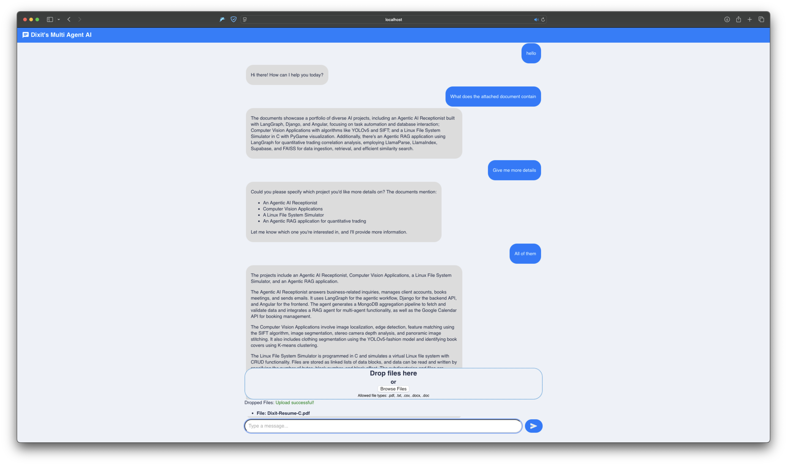
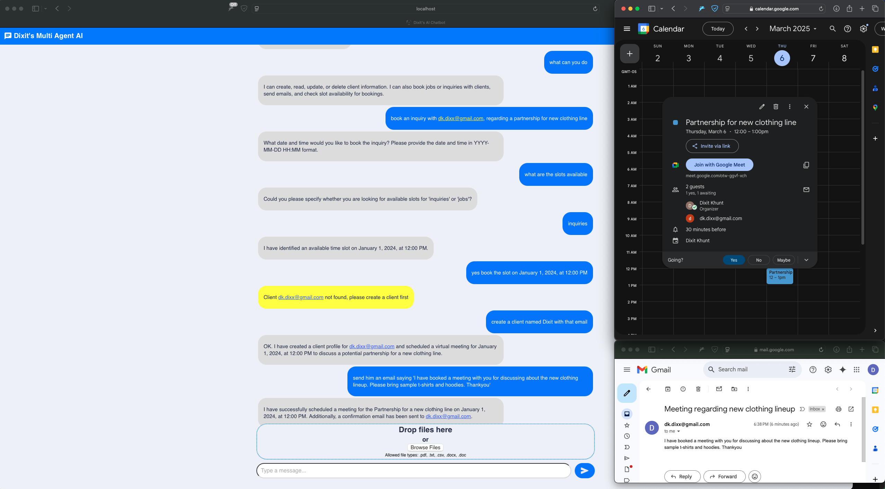

# AI Receptionist

An multi agent architecture consisting of two agents, a receptionist agent and a RAG agent, that you can interact with via a clean UI built using Angular.

A RAG agent that allows you to query your uploaded documents and/or fetch data from it's pre-loaded knowledge base. Simply upload pdf's, text documents, images etc and start asking questions. 
It can also crawl a given url, extract information in markdown format, generate vector embeddings and insert it in a database along with some metadata for metadata filtering when querying.

The receptionist agent can CRUD client accounts, books different types of meetings like, discovery calls, and/or physical visits with clients, writes and sends them emails. Google calendar integration to show booked meetings on your google calendar.


###### **A few screenshots of the agent in action:**
###### Rag in action:


###### Receptionist in action:


# Setup and run the chatbot:

## Frontend Setup and run

In a terminal window, change the directory to `chatbot-ui`, and run the following commands:

To install Angular CLI:
```bash
npm install -g @angular/**cli**
```

To install dependencies:
```bash
npm install
```

To build the app:
```bash
npm run build
```

To run the app:
```bash
npm start
```

## Backend Setup

In a separate terminal, ensure you're in the project root directory, and run the following commands:

To create a python virtual environment (optionally use conda virtual environment):
```bash
python -m venv ai_receptionist
```

To activate the virtual environment:
```bash
source ai_receptionist_venv/bin/activate
```

To install dependencies:
```bash
pip install -r requirements.txt
```

## Run the backend

Development mode:
```bash
# python manage.py runserver
uvicorn ai_receptionist_chat.asgi:application --reload
```

Production mode:
```bash
# python manage.py runserver
uvicorn ai_receptionist_chat.asgi:application
```

## Access the chatbot

**Note: When the response is a yellow bubble, it means that's the human in loop interrupt.**

Open a new browser window and navigate to `http://localhost:3000` to access the chatbot.

I've limited the number of user accounts to 2 for now. The accounts are selected automatically, and each browser tab is assigned an account. 

I am storing the account id in the browser's session storage, and the account id is selected from a list of available account ids stored in the browser's local storage.

To test the chatbot, you can open multiple browser tabs and chat with different accounts simultaneously.

